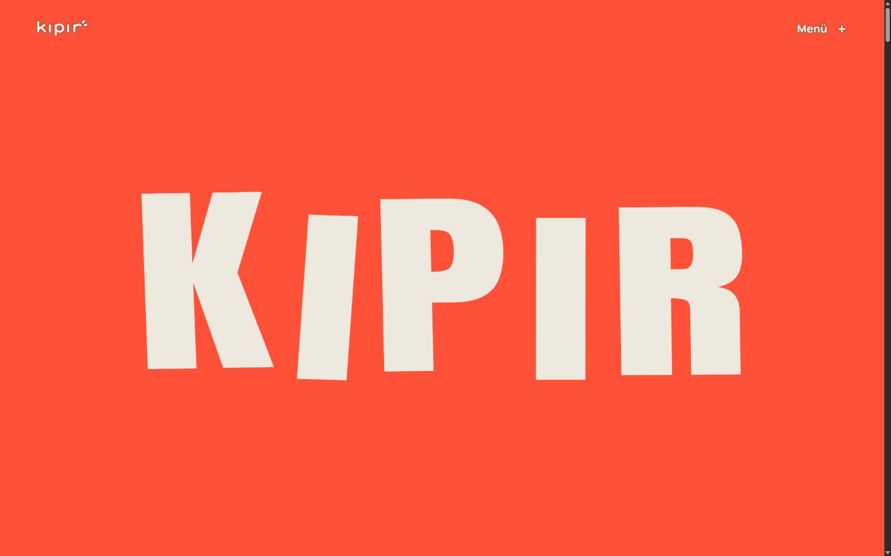
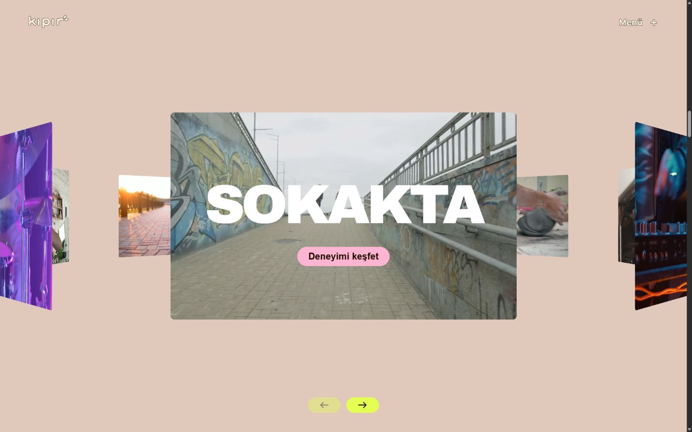
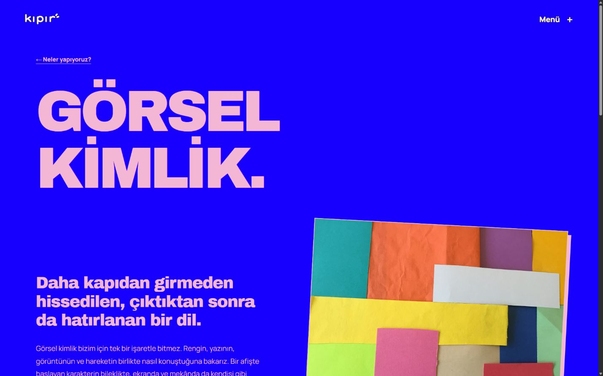
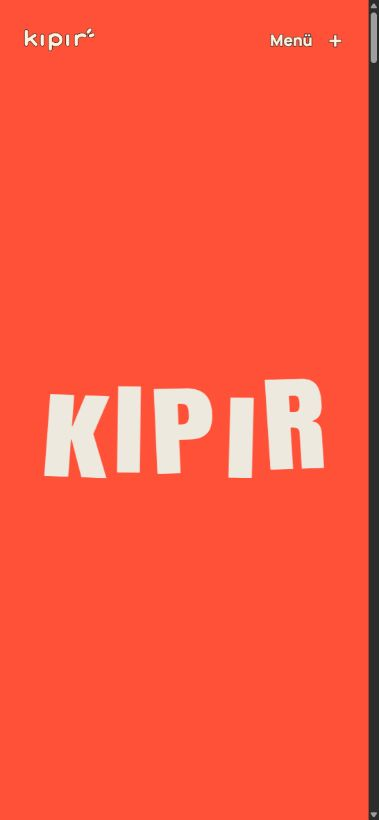

<p align="center">
  
</p>

<h1 align="center">KIPIR</h1>

<p align="center">
  <strong>İyi fikirler yerinde durmaz.</strong><br />
  Fikirleri, insanları ve mekânları aynı hikâyede buluşturan yaratıcı etkinlik ve deneyim stüdyosu.
</p>

<p align="center">
  
  
  
  
</p>

<p align="center">
  <a href="#konsept">Konsept</a> ·
  <a href="#ekran-goruntuleri">Ekran görüntüleri</a> ·
  <a href="#ozellikler">Öne çıkanlar</a> ·
  <a href="#teknoloji">Teknoloji</a> ·
  <a href="#kurulum">Kurulum</a> ·
  <a href="#kontroller">Kontroller</a>
</p>

---

<a id="konsept"></a>

## Konsept

KIPIR, yaratıcı bir stüdyonun karakterini **hareketli tipografi, perspektifli video galerisi ve güçlü renk geçişleri** üzerinden anlatan Türkçe bir portföy projesidir. Mercan, elektrik mavisi, pembe ve limon sarısı; girişten hizmet sayfalarına, stüdyo kolajından iletişim formuna kadar ortak bir görsel dil oluşturur.

Ana sayfa, altı deneyim detayı ve sekiz hizmet sayfası birlikte **15 sayfalık** bir sunum oluşturur. Seçkideki çalışmalar hayali KIPIR stüdyosu için hazırlanmış konseptlerdir; tamamlanmış müşteri işi olarak sunulmaz. İletişim formu etkileşimli bir önizlemedir ve gerçek mesaj göndermez.

<a id="ekran-goruntuleri"></a>

## Ekran görüntüleri

11 Eylül 2026'da çalışan yerel üretim çıktısından alınan gerçek arayüz görüntüleri. Masaüstü ve mobil görünümler aynı uygulamanın duyarlı yerleşimlerini gösterir.



<details>
  <summary><strong>Perspektifli deneyim galerisi</strong></summary>
  <br />
  
</details>

<details>
  <summary><strong>Hizmet detay sayfası</strong></summary>
  <br />
  
</details>

<details>
  <summary><strong>Mobil giriş</strong></summary>
  <br />
  <p align="center">
    
  </p>
</details>

<a id="ozellikler"></a>

## Öne çıkanlar

- **Hareketli açılış:** KIPIR harfleri açılışta yerleşir ve farklı ritimlerde hareket etmeyi sürdürür. Kaydırmayla logo sola çıkar; slogan satırları sağdan, soldan ve yeniden sağdan gelip ortada birleşir.
- **Üç boyutlu seçki:** sekiz farklı videodan oluşan perspektifli halka, altı konsept deneyim ve kaydırmayla birlikte ilerleyen başlıklar. İleri/geri kontrolleri aynı galeri akışını yönetir.
- **Sekiz hizmet sayfası:** etkinlik tasarımı, yaratıcı fikir, görsel kimlik, mekân ve sahne, prodüksiyon, film ve fotoğraf, birlikte üretim ve yaratıcı denemeler. Her sayfada farklı metin, fotoğraf, çıktı ve yaklaşım bulunur.
- **Tutarlı marka dili:** özgün vektör logo, büyük Archivo Black ve Anton başlıklar, kesintisiz kayan şerit, çıkartmalar ve fotoğraf kolajları.
- **Özel brief deneyimi:** Fikrin → Buluşma → Sen akışı; seçili kartta tik, Türkçe takvim, alan doğrulaması ve düzenlenebilir son kontrol özeti.
- **Duyarlı ve erişilebilir etkileşimler:** sabit gezinme, tam ekran menü, Escape ile kapatma, odak yönetimi, içeriğe geçiş bağlantısı ve azaltılmış hareket desteği.
- **Tekil ve yerel medya:** sekiz video, on bir fotoğraf, altı deneyim karesi ve iki çıkartma; her içerik varlığı kendi gösterim alanında kullanılır. Video posterleri aynı alanın yükleme alternatifidir.

### Deneyim akışı

**Hareketli giriş → konsept seçkisi → hizmetler → çalışma yaklaşımı → stüdyo → yaratıcı brief**

Deneyim ve hizmet detaylarından ilgili ana sayfa bölümüne dönülebilir. Hizmet sayfaları birbirine bağlanır; planlama bağlantıları iletişim formuna açılır.

<a id="teknoloji"></a>

## Teknoloji

| Katman | Kullanılan yapı |
| --- | --- |
| Arayüz | React 19.3, TypeScript 5.8 |
| Derleme ve geliştirme | Vite 6.4, React Vite eklentisi |
| Sayfa yönlendirme | React Router 7 |
| Animasyon | GSAP 3.15, ScrollTrigger, CSS keyframe animasyonları |
| Tasarım | Özel CSS, duyarlı grid/flex düzenleri, CSS 3D dönüşümleri |
| Tipografi | Yerel Archivo Black, Anton ve Manrope |
| Medya | Sessiz H.264 MP4, JPEG, şeffaf PNG ve özgün SVG |
| Kontrol | TypeScript, üretim derlemesi, kayıtlı tarayıcı kontrolleri |

Kesin bağımlılık sürümleri [package-lock.json](package-lock.json) içinde korunur. Uygulama, istemci tarafında çalışan bir React SPA'dır; veritabanı, API anahtarı veya harici video oynatıcı gerektirmez.

<a id="kurulum"></a>

## Kurulum

**Node.js 24** ve npm ile doğrulanmıştır. Depoya erişimi olan GitHub hesabınızla:

```sh
git clone https://github.com/furkan-akpinar/kipir-studio.git
cd kipir-studio
npm ci
npm run dev
```

Geliştirme adresi: `http://localhost:5173/`. Farklı port için `npm run dev -- --port 5186` kullanılabilir. Windows PowerShell'de betik çalıştırma kısıtı varsa `npm` yerine `npm.cmd` yazılabilir.

### Üretim derlemesi ve yerel önizleme

```sh
npm run build
npm run preview -- --host 127.0.0.1 --port 5187
```

Önizleme: `http://127.0.0.1:5187/`. Derleme önce TypeScript proje kontrolünü çalıştırır, ardından statik çıktıyı `dist/` içine yazar. Önizleme bu çıktıyı sunar; kaynak değişikliklerinden sonra yeniden derleme gerekir.

<a id="kontroller"></a>

## Kontroller

| Komut | Kapsam |
| --- | --- |
| `npm run typecheck` | TypeScript kaynak kontrolü |
| `npm run build` | TypeScript proje kontrolü ve Vite üretim derlemesi |
| `npm run preview -- --port 5187` | Derlenmiş uygulamanın yerel tarayıcı önizlemesi |

**Kaydedilmiş tarayıcı kontrolleri:** sekiz hizmet sayfasının masaüstü ve mobil açılması, farklı görsellerin yüklenmesi, sonraki sayfa bağlantıları, menü gezinmesi, form seçimleri, özel yukarı oku ve galeri videolarının oynatılması. Son hizmet sayfası kontrolleri **1440×900** ve **390×844** CSS viewport boyutlarında yapılmıştır.

Otomatik birim veya uçtan uca tarayıcı test paketi henüz yoktur. TypeScript ve derleme kontrolleri görsel doğrulamanın yerine geçmez. Gerçek cihaz, Safari ve Firefox kontrolleri yapılmamıştır. Ayrıntılı sonuçlar ve önceki sürüm kayıtları [QA belgesinde](docs/QA.md) bulunur.

## Proje yapısı

```text
src/
  components/         Giriş, galeri, menü, hizmetler, stüdyo, form ve footer
  data/               Deneyim ve hizmet içerikleri
  App.tsx             Ana sayfa, detay rotaları ve 404
  *.css               Tema ve bölümlere ait duyarlı stiller
public/
  media/              Videolar, posterler, fotoğraflar ve çıkartmalar
  fonts/              Archivo Black fontu ve lisansı
  licenses/           Anton ve Manrope lisansları
  kipir-logo.svg      Özgün marka logosu
scripts/              İlk altı videoyu hazırlayan medya betiği
docs/                 Kontrol kayıtları, medya kaynakları ve ekran görüntüleri
```

**İçerik düzenleme:** deneyimler [src/data/projects.ts](src/data/projects.ts), hizmetler [src/data/services.ts](src/data/services.ts) üzerinden yönetilir. Ana sayfa bölümleri `src/components/` içindedir. Yeni medya eklendiğinde kaynak kaydı ve kullanım dökümü de güncellenmelidir.

`node_modules/`, `dist/`, yerel ortam dosyaları ve `tmp/` Git dışında tutulur. Kaynak kod, lockfile, gerekli medya ve lisans belgeleri depoda bulunur.

## Yayın ve mevcut kapsam

Depo kaynak kodunu ve yerel çalıştırma altyapısını içerir; henüz tanımlanmış bir canlı yayın adresi yoktur. GitHub deposuna kod yüklemek siteyi otomatik olarak yayımlamaz.

Uygulama statik olarak sunulabilir. React Router yollarına doğrudan giriş için sunucunun bilinmeyen uygulama yollarını `/index.html` dosyasına yönlendirmesi gerekir. Mevcut yapı kök dizinden sunum içindir; bir alt dizine yayın yapılacaksa Vite `base`, router ve mutlak varlık yolları birlikte uyarlanmalıdır.

**İletişim formu:** bilgiler yalnızca açık sayfanın React durumunda tutulur; sunucuya gönderilmez, URL'ye veya kalıcı tarayıcı depolamasına yazılmaz. Son kontrol ekranı mesajın gönderilmediğini açıkça belirtir. Gerçek kullanım için iletişim bilgileri, sunucu doğrulaması, gönderim servisi ve uygun aydınlatma metni tamamlanmalıdır.

## Belgeler ve medya

| Belge | İçerik |
| --- | --- |
| [QA kaydı](docs/QA.md) | Yapılan kontroller, önceki revizyonlar ve doğrulanmamış ortamlar |
| [Medya ve lisanslar](docs/MEDIA.md) | Kaynaklar, üreticiler, fontlar ve kullanım açıklamaları |
| [Medya kullanım dökümü](docs/MEDIA_USAGE.md) | Her görsel ve videonun tekil gösterim alanı |
| [Fotoğraf kayıtları](docs/photo-media.json) | On bir fotoğrafın kaynağı, lisansı, ölçüsü ve SHA-256 değeri |
| [Ek galeri klipleri](docs/orbit-media.json) | İki ek videonun kaynağı ve işleme bilgileri |

Videolar Mixkit; fotoğraflar Unsplash ve Pexels kaynaklı lisanslı stok içeriklerdir. KIPIR'ın gerçekleştirdiği etkinliklerin veya kendi ekibinin belgesel görüntüleri olarak sunulmaz. İki çıkartma bu proje için görsel üretim aracıyla hazırlanmıştır; logo özgün vektör çizimidir.

Proje için ayrı bir kök lisans dosyası tanımlanmamıştır. Üçüncü taraf paket lisansları ilgili bağımlılıklarda korunur. Yerel fontlar SIL Open Font License kapsamındadır: [Archivo Black](public/fonts/archivo-black-OFL.txt) · [Anton](public/licenses/Anton-OFL.txt) · [Manrope](public/licenses/Manrope-OFL.txt).

README ekran görüntüleri bu uygulamanın kendi arayüzünden alınmıştır.

---

<p align="center">
  <strong>Furkan Akpınar</strong> · <a href="https://github.com/furkan-akpinar">GitHub</a>
</p>
